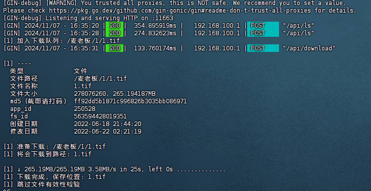

# BaiduPCS-WEB-new

基于@qjfoidnh大佬的3.9.5的源码和@wuzhican大佬给出的WEB API写了个简单的WEB页面


配合后端，可以将百度云完全托管在家庭服务器或者软路由中
再结合类似于DDNSTO这种内网穿透工具，可以实现人在外网环境下挂起百度云下载服务

## PS：本软件不提供超出官方客户端的下载提速，有重度使用需求的还是建议开通SVIP

# 本项目还比较简陋，对于文件的下载状态、下载位置显示和控制不够精确

## 开发环境配置

### 1. 克隆项目

```bash
git clone https://github.com/yourusername/BaiduPCS-WEB-new.git
cd BaiduPCS-WEB-new
```

### 2. 安装依赖

```bash
npm install
```

### 3. 本地开发

```bash
npm start
```

本地开发环境会自动在 <http://localhost:3000> 启动，并通过 package.json 中的 proxy 配置将 API 请求代理到 <http://localhost:11663。>

## 生产环境部署

### 1. 构建前端项目

```bash
# 在项目根目录下执行
npm run build
```

这将在 `build` 目录下生成静态文件。

### 2. 在 OpenWrt 上安装配置 Nginx

#### 2.1 安装 Nginx

```bash
bash
opkg update
opkg install nginx
```

#### 2.2 创建网站目录

```bash
mkdir -p /www/wwwroot/baidupcs-web
```

#### 2.3 配置 Nginx HTTP 认证

#### 2.3.1 安装 htpasswd 工具

```bash
# 安装 htpasswd 工具
opkg update
opkg install apache-utils

# 创建密码文件（根据提示输入密码）
htpasswd -c /etc/nginx/passwd your_username
```

#### 2.3.2 创建 Nginx 配置文件

创建文件 `/etc/nginx/conf.d/baidupcs-web.conf`：

```nginx
server {
    listen 11892;
    server_name localhost;

    # 添加 HTTP 基本认证
    auth_basic "Restricted Access";
    auth_basic_user_file /etc/nginx/passwd;

    # 前端静态文件
    location / {
        root /www/netdisk;
        try_files $uri $uri/ /index.html;
        index index.html;
    }

    # API 反向代理
    location /api/ {
        proxy_pass http://localhost:11663/api/;
        proxy_set_header Host $host;
        proxy_set_header X-Real-IP $remote_addr;
        
        # CORS 配置
        add_header 'Access-Control-Allow-Origin' '*';
        add_header 'Access-Control-Allow-Methods' 'GET, POST, OPTIONS';
        add_header 'Access-Control-Allow-Headers' 'DNT,User-Agent,X-Requested-With,If-Modified-Since,Cache-Control,Content-Type,Range';
    }
}
```

#### 2.4 部署静态文件

```bash
# 在本地执行，将构建好的文件传输到路由器
scp -r build/ root@<router-ip>:/www/netdisk/
```

#### 2.5 启动 Nginx 并设置开机自启

```bash
# 测试配置文件
nginx -t

# 启动 Nginx
/etc/init.d/nginx start

# 设置开机自启
/etc/init.d/nginx enable
```

### 3. 访问地址

- 开发环境：<http://localhost:3000>
- 生产环境：<http://192.168.100.1:11892>

#### 前端预览效果


#### 后端预览效果



## 注意事项

### 0. 后端配置

- 后端服务参考仓库里面的BaiduPCS-Go-API
- 新建一个tmux，在里面设置好相关配置和BDUSS、STOKEN
- 在tmux中cd到BaiduPCS-Go执行文件所在的位置，执行 `BaiduPCS-Go`进入服务模式，`help`命令可以看到大部分帮助，执行`serve --port 11663`开启API服务， 默认已经添加环境变量

### 1. 端口配置

- 前端服务端口：11892
- 后端API端口：11663
- 确保 OpenWrt 防火墙已开放这些端口

### 2. 防火墙配置

```bash
# 在 OpenWrt 中开放端口
uci add firewall rule
uci set firewall.@rule[-1].name='Allow-NetDisk'
uci set firewall.@rule[-1].target='ACCEPT'
uci set firewall.@rule[-1].src=''
uci set firewall.@rule[-1].proto='tcp'
uci set firewall.@rule[-1].dest_port='11892'
uci commit firewall
/etc/init.d/firewall restart
```

### 3. 常见问题排查

#### 3.1 无法访问网站

- 检查 Nginx 是否正常运行：`ps | grep nginx`
- 检查端口是否被占用：`netstat -tlnp | grep 11892`
- 检查防火墙规则：`iptables -L`

#### 3.2 API 请求失败

- 检查后端服务是否运行
- 检查 Nginx 反向代理配置
- 查看 Nginx 错误日志：`tail -f /var/log/nginx/error.log`

#### 3.3 静态资源 404

- 检查文件是否正确部署到 `/www/netdisk/`
- 检查文件权限：`ls -la /www/netdisk/`
- 确保 Nginx 配置中的 root 路径正确

### 3.4 认证相关问题

- 如果忘记密码，可以重新运行 `htpasswd` 命令创建新密码
- 如果要添加新用户：`htpasswd /etc/nginx/passwd new_username`
- 如果要删除用户：`htpasswd -D /etc/nginx/passwd username`
- 如果要修改现有用户密码：`htpasswd /etc/nginx/passwd existing_username`

## 项目结构

```txt
BaiduPCS-WEB-new/
├── public/ # 静态资源
├── src/
│ ├── components/ # React 组件
│ ├── services/ # API 服务
│ ├── config/ # 配置文件
│ └── App.jsx # 主应用组件
├── package.json # 项目配置
└── README.md # 项目文档
```
